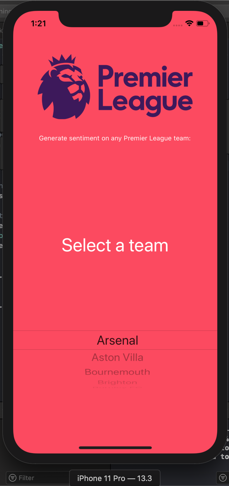
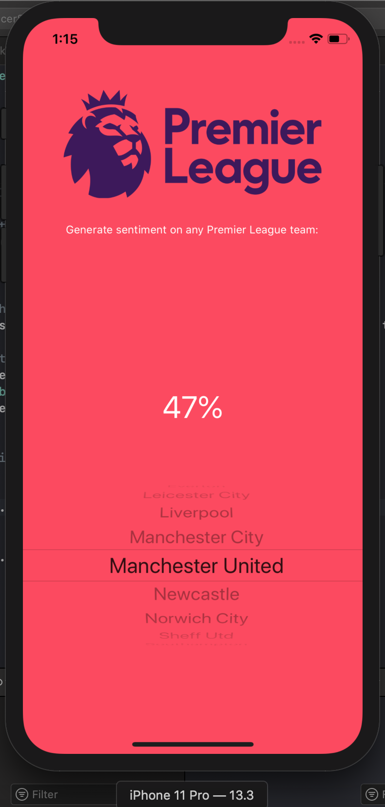
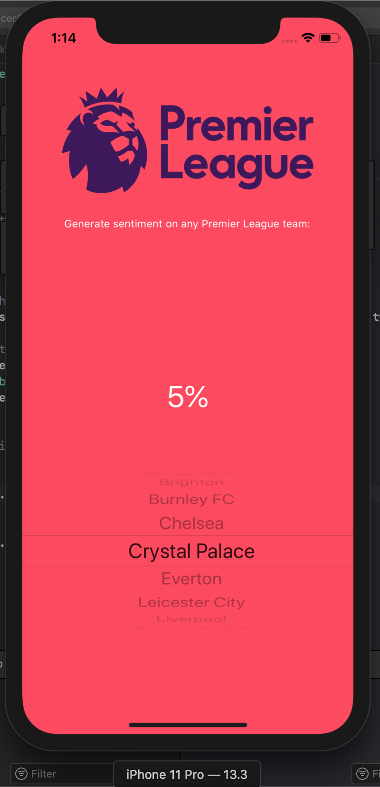

## Overview
A sentiment analysis iOS app made specially for Premier League soccer fans who want to gauge the overall sentiment, based on the latest 100 Tweets, of any 2020 Premier League team. The sentiment ranges from 0 to 100%, a higher percentage indicating stronger positive sentiment.

## Libraries used
- SwifteriOS
- SwiftyJSON

## Frameworks used
- Core ML
- Create ML

## Demonstration

  

